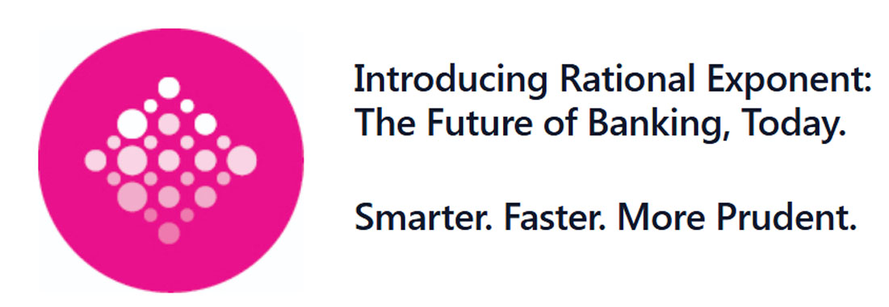



 

    
  

 



 


 

    
AI Built By Bankers
 
    
Designed For Banks

     
    
Banks today are under increasing pressure to move faster and work smarter. But legacy infrastructure, regulatory complexity, and resource constraints continue to limit growth and delay innovation—at precisely the time when agility is mission-critical.

  

  
  

    
  

 

    
  

  

    
Rational Exponent
 
    
 makes that possible.

     
    
The opportunity is clear: transform governance and risk from operational overhead into intelligent drivers of business acceleration, adaptability, and scale. Rational Exponent makes that possible. Built by bankers, technologists, and regulatory experts, Rational Exponent’s AI-powered platform, RE:Agent, empowers banks to operate with precision, speed, and strategic clarity. We don’t just understand the challenge—we’ve lived it. That’s why we’ve reimagined operational risk and governance as catalysts for transformation and growth, not constraints.
   

  

 



{}
Unlock Strategic Business Value
{}
 

















 

    

      {}
RE:Agent - Your Engine for Intelligent Business Execution
{}
    

     
    
RE:Agent doesn’t just streamline compliance—it infuses intelligence into every layer of your operations. We’ve transformed static policies and regulatory obligations into dynamic, execution-ready intelligence—embedding them seamlessly into daily workflows. This enables banks to move faster, act smarter, and innovate safely—with controls, governance, and context always in place.
     Purpose-built for agility, transparency, and scale, RE:Agent delivers business value from day one—without disrupting routines or requiring complex retraining. Our intuitive AI interfaces, designed by industry insiders, allow teams to translate insight into action instantly, accelerating outcomes and elevating operational performance.

  

  
  

    
  


 

{}
From Operational Drag  to Business Agility.
{}


{}

 

    
RE:Agent breaks free from:

    

      <ul>
         <li>Legacy workflows that slow execution
         <li>Manual processes that increase cost and risk
         <li>Fragmented systems that block innovation
         <li>Decision delays driven by policy uncertainty or misalignment

      </ul>
  

  
  

    
RE:Agent delivers:

    

      <ul>
         <li>Dynamic Business Alignment  Translate real-time change into actionable guidance
         <li>AI-Powered Decision Support  Enable faster, more confident decision-making
         <li>Execution-Ready Intelligence  Turn insight into frontline action without delay
         <li>Safe, Prudent Innovation  Launch new models with controls and clarity built in
      </ul>
   

  

{}


{}
Practical 
Design.
Strategic 
Value.
Proven 
ROI.
{}



 
  

    
  

  

    
<b>RE:Agent </b> is built for the way banks work—and for the way banks need to grow. Our approach is grounded in practical experience and intelligent design:

     
   
Ease of Adoption — 

Intuitive interfaces require little to no training

    
Streamlined Operations — 

Embedded intelligence replaces document digging and manual enforcement

    
Accelerated Decisions — 

Contextual guidance enables fast, explainable actions

    
Scalable Intelligence — 

Grow your operations without bloating your workforce or risk exposure

    
Innovation with Control — 

New products, new markets, zero unnecessary risk

  

  

 

{}
Strategic 
Outcomes. 
Measurable 
Value. 
Intelligent 
Control.
{}

 

    
<b>Introducing  </b><b>RE:Agent </b><b>- the Future of Banking,  </b><b>Today.</b> 
    

     
    
<b>RE:Agent </b> supercharges your bank’s ability to adapt, act, and accelerate. Intelligence is embedded directly into workflows—enabling smarter decisions, faster execution, and safer innovation within a unified framework.

  

  

    
  

  
 
 


{}
Why  Rational Exponent
?
{}



<b>RE:Agent </b> isn’t just about compliance — it’s about transformation. It enables faster execution, safer decisions, and measurable ROI across your front to back business lifecycle: risk, compliance, and innovation.

Risk and governance shouldn’t slow you down—they should power your growth.

Working with Rational Exponent, your control processes become catalysts for growth, not cost centers. So you can lead with confidence!

Ready to Modernize Your Bank — Smarter, Faster, and Safer.



 
{}

    <a href="/contact" class="bg-pink-600 text-white font-semibold rounded-full px-8 py-3 shadow-lg hover:bg-pink-700 transition-colors duration-300 focus:outline-none focus:ring-2 focus:ring-pink-500 focus:ring-opacity-50">
        Get In Touch!
    </a>

{}
