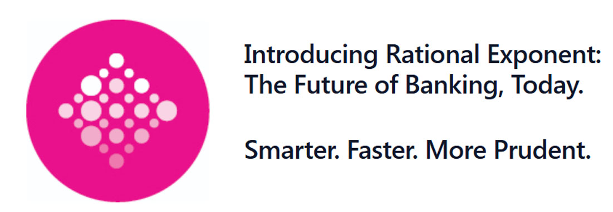

{}
Rational Exponent Leadership Team
{}

With over three decades of collective experience delivering enterprise-scale innovation, our leadership team is recognized for shaping and delivering the foremost transformative software solutions to global customers in financial services, banking, and other regulated industries — partnering with some of the world’s leading institutions.



 

    
Ryan Schoenfeld
 
    
Chief Executive Officer

    
Ryan Schoenfeld specializes in driving growth and scaling businesses including leading all sales, account management, and commercial aspects for high-growth and startup companies. With over 25 years of experience in leadership roles, Ryan has led go-to-market strategies across industry sectors such as banking and government. His executive roles have focused on aligning customer successes with enterprise delivery, and generating revenue that has enabled increasing valuation, and preparing for exit and sale. Most recently, Ryan served as Global CRO at Virtual Clarity, acquired by DXC in 2019.

  

  
  

    
  



 



 
  

    
Rens Troost
 
    
Chief Technology Officer

    
Rens Troost is a seasoned CTO and repeat company founder with a proven track record of converting technology innovation into shareholder value. Co-founder of Virtual Clarity and NAME.COM, Rens has also held leadership and board roles with SMTP.COM, Sharpspring, Lehman Brothers, Moore Capital Management, UBS, and DXC. His experience spans startups to global enterprises to public company boards where his focus on transformation has consistently resulted in strategic business growth.

  

  

    
  

  




 

    
Brian Glasser
 
    
Chief Operating Officer

    
Brian Glasser brings to Rational Exponent more than 30 years of experience in the financial industry. Brian has led operations and growth at multiple firms, including Spring Lake Consulting, acquired by Mitchell Martin in 2017, and Virtual Clarity, where he served as U.S. CEO where he drove successful acquisition by DXC in 2019. He holds a bachelor’s degree in Finance from Lehigh University and an MBA in Finance and Statistics from NYU’s Stern School of Business.

  

  
  

    
  



 



 
  

    
Brian Bauer 
 
    
VP of Artificial Intelligence Products

    
Brian Bauer brings to Rational Exponent over two decades of expertise in business transformation and modernization, leveraging cutting edge technologies to solve business challenges and drive revenue for clients and stakeholders. As VP of Artificial Intelligence Products, he is leading go-to-market strategies that help organizations succeed with AI. Throughout his career, Brian has invented innovative technology products based on NLP, sentiment mining and analysis, and machine learning models—securing patents that are often cited by industry-leading companies such as Google, Microsoft, Sony, AT&T, Ebay, Cisco, Seiko, Stubhub, GE, IBM, and Penn, among dozens of others. His current focus is on developing AI technology that enables customers to drive real, reliable business value and strategic outcomes.

  

  

    
  

  



{}
Our Story
{}



Massive progress is taking place in enabling AI for the enterprise: from foundation models and guardrails, to development frameworks and retrieval technologies, the pace of technical innovation is unmatched since the dawn of the information age. Seeing the tremendous opportunity this technology represents, and the massive gap between the promise of the technology and the reality of putting it to work for business, our founding team set out to bridge the gap.

Despite headwinds (scarcity of talent, of computer hardware for training and inference, cost scaling, and lack of a consensus approach to risk management for both the enterprise and societal impacts) venture investment in the technology sector and strategic investments at leading enterprises are starting to turn the promise of AI foundation models into an exciting new reality.

friendly productive robot
Before these promising technical capabilities can turn into sustainable business value, much less herald the transformation of industry that is in the offing, they will have to be adapted to support the needs and processes of industry: reliability, transparency, and effecitve application to business processes. This is especially true for critical services in regulated industries.

Rational Exponent was founded to address this gap in the market by a team of bankers, technologists, and business innovators with a track record of successful startups turning technical invention into business innovation.

    
  


